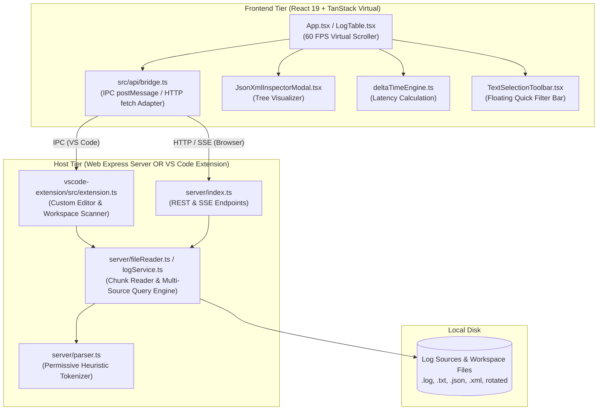

# LogViewer

> **High-Performance Local Log Inspector & Native VS Code Extension.**  
> Built for fast root-cause analysis, 60 FPS virtualized scrolling across 100,000+ log lines, zero-schema heuristic parsing, microsecond delta latency measurements, multi-source stream merging, and native VS Code jump-to-source code navigation.

---

## ✨ Key Features & Capabilities

- 🏎️ **60 FPS DOM Virtualization Engine**: Powered by `@tanstack/react-virtual`. Scrolls effortlessly through 100,000+ raw, flat, JSON, or XML log entries while maintaining a low memory footprint by rendering only 40–80 physical DOM elements at any time.
- 🎯 **Jump-to-Source Code Navigation (VS Code Extension)**: When running inside VS Code, every trailing code location badge `[FileName.ext::LineNumber]` and stack trace frame becomes an interactive link. Clicking a location searches the active workspace and opens the exact source file with the line highlighted side-by-side in an adjacent editor split.
- 🔌 **Dual Target Architecture (Web App & VS Code Extension)**:
  - **Standalone Web App**: Air-gapped, zero-cloud Express server + Vite React application listening on `localhost`.
  - **VS Code Extension**: Custom Editor (`*.log`, `*.txt`), command palette shortcuts, and native IPC message bus without port friction or background HTTP servers.
- 🔍 **Permissive Zero-Schema Heuristic Parsing**: Automatically extracts ISO timestamps, 11-level severity tags (`EMERGENCY`, `ALERT`, `CRITICAL`, `ERROR`, `WARNING`, `NOTICE`, `INFO`, `AUDIT`, `DEBUG`, `TRACE`, `UNKNOWN`), Process IDs (`PID`), Thread IDs (`TID`), Correlation IDs, Namespaces, Workflow markers, Durations (`45ms`, `1.2s`), HTTP status codes (`200`, `500`), and multi-line stack trace frames. Handles plain markerless logs, JSON logs, and XML logs natively.
- 🔀 **Multi-Source Selection & Unified Stream**: Select single or multiple log files simultaneously to view a merged chronological log stream with color-coded source badges.
- ⏱️ **Delta Time Latency Engine**: Select any log line as Anchor ($T_1$) and another as Target ($T_2$) to calculate exact forward and backward latency deltas (in microseconds, milliseconds, or seconds), step counts, and velocity throughput rates between events.
- 🪄 **Floating Contextual Selection Toolbar**: Highlight any text snippet or token in a log entry to summon a floating quick-action toolbar:
  - **🔍 Include in search** (`+`)
  - **🚫 Exclude / NOT filter** (`-`)
  - **📦 Inspect JSON / XML tree** (`{}`)
  - **⏱️ Set Delta Anchor** (`T1 / T2`)
- 📦 **Embedded JSON & XML Tree Inspector**: Visual interactive node tree inspector for embedded payloads with syntax validation, formatting toggles (Pretty 2-space / Minified), key search, JSON path copy (`$.data[0].id`), and collapsible XML tree nodes.
- ⚡ **Live Stream Tail & Dual Velocity Rate Tracking**: Tail active log files in real-time (SSE for Web, FileWatcher IPC for VS Code) with auto-scroll snapping, unread entry badges, and dual velocity rate gauges (Instantaneous additions/sec vs. Average addition velocity).
- 📋 **Paste Raw Logs Modal**: Instant ad-hoc analysis of clipboard text, stack traces, or terminal output without saving to disk.
- 📑 **Context Slices (Surrounding Lines Viewer)**: View $\pm 10$, $\pm 50$, or $\pm 100$ lines before and after any target log entry in unmodified chronological file order with target line pinning.
- 🏷️ **Presets & Workspace Management**: Pre-configured incident triage presets (*Errors & Crashes*, *Slow Operations >500ms*, *Security & Auth*, *Warnings & Retries*) plus custom user preset saving, export, and import.
- ⌨️ **Precision Keyboard Navigation**: 100% keyboard-driven workflow: cursor movement (`j`/`k`, `gg`/`G`), range selection (`Shift+Down`), line jumping (`Ctrl+G`), search focus (`/`), preset opening (`p`), view mode toggling (`v`), and help cheat sheet (`?`/`F1`).
- 🛡️ **100% Air-Gapped & Local-First**: Self-contained local execution with zero remote tracking or cloud dependencies.

---

## ⚡ Quick Start

### 1. Web Application Mode

```bash
# Clone repository
git clone https://github.com/amansaxna/LogViewer.git
cd LogViewer

# Install dependencies
npm install

# Start Express server (:3001) and Vite dev server (:3002) in parallel
npm run dev:all
# or using Makefile:
make dev
```

Open your browser at **[http://localhost:3002](http://localhost:3002)** (or `http://localhost:3001` for production bundle).

### 2. VS Code Extension Mode

```bash
# Build React bundle and compile VS Code extension
npm run build:ext

# Package as .vsix file
npm run package:ext

# Install in VS Code
code --install-extension vscode-extension/logviewer-1.0.0.vsix
```

Or open the repository in VS Code and press **`F5`** to launch the Extension Development Host.

---

## 📁 Architecture Overview



---

## ⌨️ Keyboard Shortcuts Cheat Sheet

LogViewer is designed for complete keyboard-driven navigation:

| Key | Action | Description |
| :---: | :--- | :--- |
| `j` / `↓` | **Cursor Down** | Move active line cursor to next log line |
| `k` / `↑` | **Cursor Up** | Move active line cursor to previous log line |
| `g` `g` / `Home` | **Jump to Top** | Instantly jump to the first log entry |
| `G` / `End` | **Jump to Bottom** | Instantly jump to the latest log entry |
| `Shift + ↓` | **Select Down** | Extend multi-line selection downward |
| `Shift + ↑` | **Select Up** | Extend multi-line selection upward |
| `Ctrl + a` | **Select All** | Select all visible filtered lines |
| `Ctrl + c` | **Copy** | Copy selected lines to OS clipboard with toast notification |
| `/` or `Ctrl + f` | **Search** | Focus the search & filter bar |
| `1` - `5` | **Filter Level** | Toggle severity levels (1=Error, 2=Warn, 3=Info, 4=Debug, 5=Trace) |
| `t` | **Toggle Live Tail** | Enable / disable auto-scroll on live incoming logs |
| `v` | **Cycle View Mode** | Toggle between `Compact`, `Standard`, and `Raw` |
| `w` | **Line Wrap** | Toggle word wrapping on and off |
| `+` / `-` | **Zoom Font** | Increase / decrease font size |
| `Ctrl + g` | **Go to Line** | Jump directly to a specific source line number |
| `p` | **Presets** | Open Saved Workspaces and Incident Presets modal |
| `?` or `F1` | **Shortcuts Help** | Display interactive keyboard shortcut cheat sheet |

---

## 🔌 VS Code Extension Integration

- **Custom Editor Integration**: Right-click any `.log` or `.txt` file $\to$ **Open With... $\to$ LogViewer**.
- **Jump-to-Source**: Click any code location badge `[AuthTokenProvider.ts::88]` or stack trace frame to open the file at that exact line side-by-side in VS Code.
- **Workspace Auto-Discovery**: Automatically indexes all `.log` files across open workspace folders.
- **Native OS File Dialog**: Open any arbitrary file using VS Code's native file picker.

---

## 🛠️ Development & Build Automation

```bash
# Run unit test suite
npm test

# Build Web frontend
npm run build

# Build VS Code extension
npm run build:ext

# Package VSIX extension
npm run package:ext
```

---

## 📄 License

This project is licensed under the **MIT License** — see the [LICENSE](LICENSE) file for details.
