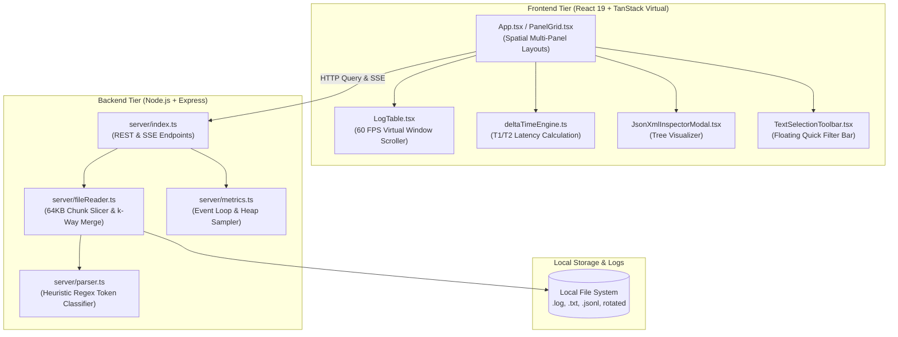

<div align="center">

# ⚡ LogViewer

**High-Throughput, Local-First Structured Log Observability & Multi-Panel Analysis Workspace**

[](LICENSE)
[](https://nodejs.org)
[](https://react.dev)
[](https://www.typescriptlang.org)
[](https://tanstack.com/virtual)
[](docs/blueprint/HLD.md)
[](test/)

<p align="center">
  <a href="#-key-features">Key Features</a> •
  <a href="#-quick-start">Quick Start</a> •
  <a href="#-system-architecture">Architecture</a> •
  <a href="#-keyboard-shortcuts">Keyboard Shortcuts</a> •
  <a href="#-blueprint-documentation">Blueprint Docs</a> •
  <a href="#-contributing">Contributing</a>
</p>

</div>

---

## 🚀 Overview

**LogViewer** is an ultra-fast, local-first web application designed for software engineers, DevOps practitioners, and SREs triaging high-volume flat, semi-structured, and rotated log files. 

Unlike heavy cloud monitoring platforms (Datadog, Splunk, Elastic) that introduce latency, network egress costs, and data privacy concerns during local development, **LogViewer runs 100% locally on your machine with zero external exfiltration**. It bridges the gap between CLI tools (`less`, `grep`, `tail -f`) and enterprise observability suites by delivering **60 FPS virtualized rendering, zero-config heuristic token classification, spatial multi-panel workspaces, and sub-millisecond delta time latency measurements**.

```
+-----------------------------------+-----------------------------------+
| Panel 1: API Gateway (Live Tail)  | Panel 2: Auth Service (Errors)    |
| [P1] 2026-09-06 14:10:00 GET /api | [P2] 2026-09-06 14:10:01 [ERROR]  |
| [P1] 2026-09-06 14:10:02 POST /v1 | [P2] 2026-09-06 14:10:03 JWT Exp  |
+-----------------------------------+-----------------------------------+
| Panel 3: Database Slow Query Log  | Panel 4: Redis Cache Stream       |
| [P3] 2026-09-06 14:10:01 450ms SQL| [P4] 2026-09-06 14:10:02 CACHE HIT|
+-----------------------------------+-----------------------------------+
```

---

## ✨ Key Features

- 🏎️ **60 FPS DOM Virtualization**: Powered by `@tanstack/react-virtual`. Seamlessly scrolls through 1,000,000+ log lines while strictly rendering only 40–80 physical DOM nodes.
- 🔍 **Zero-Schema Heuristic Parsing**: Automatically detects and classifies ISO timestamps, 11-level severity tags (`ERROR`, `WARN`, `INFO`, `DEBUG`, etc.), Process IDs (`PID`), Thread IDs (`TID`), Correlation/Trace IDs, Namespaces, Durations (`45ms`), HTTP status codes (`200`, `500`), and multi-line exception stack traces.
- 🪟 **Spatial Multi-Panel Workspaces**: Split your workspace into 1, 2-column, 2-row, 3-grid, or 4-quadrant layouts. Compare multiple log files, rotated archives, or different query filters side-by-side with independent state.
- ⏱️ **Delta Time Latency Engine**: Set any log line as Anchor (T1) and another as Target (T2) to compute microsecond/millisecond execution latencies and event throughput rates.
- 🪄 **Floating Contextual Selection Toolbar**: Highlight any text or token in a log row to summon instant 1-click actions: Include in search, Exclude (`NOT` filter), Inspect JSON/XML, or Set Delta anchor.
- 📦 **Embedded JSON & XML Tree Inspector**: Interactive visual node tree for embedded payloads with syntax validation, formatting toggles (Pretty/Minify), key search, and JSON path copy.
- ⚡ **Live Real-Time SSE Stream Tail**: Tail active log files in real-time over Server-Sent Events with dynamic auto-scroll and unread counter badges.
- ⌨️ **28 Precision Keyboard Shortcuts**: 100% mouse-free developer experience with conflict-free navigation, range selection (`Shift+Down`), line jumping (`Ctrl+g`), and layout cycling.
- 🛡️ **100% Air-Gapped & Local-First**: Self-contained architecture running on `localhost`. No data leaves your workstation.
- 📊 **Native System Telemetry**: Live sampling of Node.js Event Loop Lag (Min, Mean, P50, P90, P95, P99, Max), heap memory vitals, and query SLA response times.

---

## ⚡ Quick Start

### Prerequisites
- **Node.js**: `>= 18.0.0`
- **npm**: `>= 9.0.0`
- **Make**: (Optional, standard on macOS/Linux)

### Installation & Launch

```bash
# Clone the repository
git clone https://github.com/amansaxna/LogViewer.git
cd LogViewer

# Install dependencies
npm install

# Start both Express backend (:3001) and Vite dev server (:3002) in parallel
make dev
```

Open your browser at:
- 🌐 **Web UI**: [http://localhost:3002](http://localhost:3002) (or [http://localhost:3001](http://localhost:3001) for the production server bundle)

---

## 📁 System Architecture



---

## ⌨️ Keyboard Shortcuts Cheat Sheet

LogViewer is designed for complete keyboard-driven navigation:

| Key | Action | Description |
| :---: | :--- | :--- |
| `j` / `↓` | **Cursor Down** | Move active line cursor to next log line |
| `k` / `↑` | **Cursor Up** | Move active line cursor to previous log line |
| `g` `g` / `Home` | **Jump to Top** | Instantly jump to the first log entry |
| `G` / `End` | **Jump to Bottom** | Instantly jump to the latest log entry |
| `Shift + ↓` | **Select Down** | Extend multi-line selection downward |
| `Shift + ↑` | **Select Up** | Extend multi-line selection upward |
| `Ctrl + a` | **Select All** | Select all visible filtered lines in active panel |
| `Ctrl + c` | **Copy** | Copy selected lines to OS clipboard |
| `/` or `Ctrl + f` | **Search** | Focus the search & filter bar |
| `1` - `5` | **Filter Level** | Toggle severity levels (1=Error, 2=Warn, 3=Info, 4=Debug, 5=Trace) |
| `t` | **Toggle Live Tail** | Enable / disable auto-scroll on live incoming logs |
| `v` | **Cycle View Mode** | Toggle between `Compact`, `Standard`, and `Raw` |
| `w` | **Line Wrap** | Toggle word wrapping on and off |
| `+` / `-` | **Zoom Font** | Increase / decrease font size |
| `Alt + 1..4` | **Layout Grid** | Switch grid layout (1=Single, 2=2-Col, 3=2-Row, 4=4-Quadrant) |
| `Tab` | **Cycle Focus** | Switch focus between panels (`P1` $\rightarrow$ `P2` $\rightarrow$ `P3` $\rightarrow$ `P4`) |
| `Ctrl + g` | **Go to Line** | Jump directly to a specific source line number |
| `p` | **Presets** | Open Saved Workspaces and Incident Presets modal |
| `h` | **Health Diagnostics**| Open System Telemetry & Event Loop Lag dashboard |
| `?` or `F1` | **Shortcuts Help** | Display interactive keyboard shortcut cheat sheet |

---

## 📚 Blueprint & Architecture Documentation

For complete technical specifications, diagrams, and audits, explore the `docs/blueprint/` directory:

- 🏛️ **[High-Level Design (HLD)](docs/blueprint/HLD.md)**: System context (C4 Level 1), Container architecture (C4 Level 2), $O(N \log K)$ multi-source interleaving, memory boundaries, and sequence pipelines.
- ⚙️ **[Low-Level Design (LLD)](docs/blueprint/LLD.md)**: Component diagrams (C4 Level 3), code flows (C4 Level 4), heuristic token state machines, virtual scroll math, and delta latency algorithms.
- 📋 **[Feature List & Capabilities Matrix](docs/blueprint/FEATURE_LIST.md)**: Comprehensive breakdown of all 15 major subsystems, filter capabilities, token extractors, and preset schemas.
- 🛡️ **[Senior Architecture Review](docs/blueprint/ARCHITECTURE_REVIEW.md)**: Formal audit and sign-off report by a Principal Distributed Systems & Performance Architect (Rated **9.7 / 10.0**).

---

## 🔌 REST & SSE API Reference

| Endpoint | Method | Description | Parameters |
| :--- | :---: | :--- | :--- |
| `/api/logs/query` | `GET` | Execute filtered, paginated query on log sources. | `sources`, `q`, `level`, `page`, `limit`, `sort` |
| `/api/logs/live/:id` | `GET` | Open real-time SSE stream tail for an active log source. | `:id` (Source ID) |
| `/api/logs/sources` | `GET` | Discover configured log sources and rotated files. | `folder`, `recursive` |
| `/api/logs/context` | `GET` | Fetch surrounding $\pm N$ lines for a specific line number. | `sourceId`, `line`, `linesBefore`, `linesAfter` |
| `/api/telemetry` | `GET` | Retrieve real-time Event Loop Lag and Heap Vitals. | — |
| `/api/config` | `GET` | Retrieve active backend configuration. | — |

---

## 🛠️ Development & Testing

```bash
# Run all automated test suites
npm test

# Run tests in watch mode
npm run test:watch

# Compile TypeScript and build production bundle
npm run build

# Start production server
npm start
```

---

## 🤝 Contributing

We welcome contributions from the community! To contribute:
1. Fork the repository.
2. Create a feature branch: `git checkout -b feat/amazing-feature`.
3. Commit your changes: `git commit -m 'feat: add amazing feature'`.
4. Run all test suites: `npm test && npm run build`.
5. Push to your branch: `git push origin feat/amazing-feature`.
6. Open a Pull Request.

---

## 📄 License

This project is licensed under the **MIT License** — see the [LICENSE](LICENSE) file for details.
