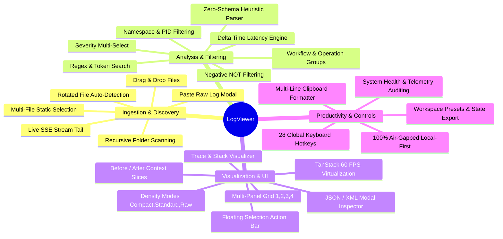
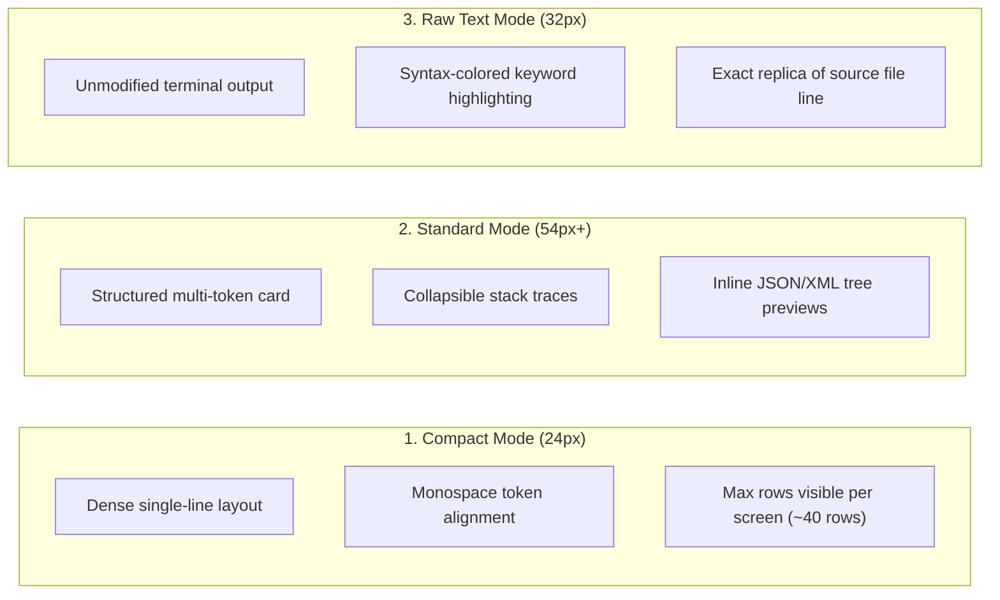

# Feature List & Capabilities Matrix: LogViewer

> **Document Version**: 2.0.0  
> **Target Audience**: Engineers, SREs, Product Managers, Open-Source Contributors  
> **Platform**: LogViewer High-Performance Log Analysis & Telemetry Platform  

---

## 1. Feature Matrix Overview

LogViewer is an enterprise-grade, local-first log observability and telemetry workspace designed to handle flat, unstructured, and structured log files with zero setup.



---

## 2. Detailed Feature Catalog

### 2.1 Ingestion & File Discovery

| Feature | Description | Technical Implementation |
| :--- | :--- | :--- |
| **Multi-Source Selection** | Select one or multiple log files simultaneously to view unified chronological streams. | `LogPanel.tsx`, `fileReader.ts` $O(N \log K)$ k-way merge sort. |
| **Rotated File Detection** | Automatically detects and groups rotated siblings (e.g. `app.log.1`, `app.log.2`, `app.log.2026-09-05`). | `server/config.ts` regex glob scanner. |
| **Recursive Folder Scanning** | Configure source directories to scan subdirectories for `.log`, `.txt`, `.jsonl`, `.out` files. | Recursive `fs.readdir` in `server/config.ts`. |
| **Live SSE Real-Time Tail** | Watch active files in real-time as logs are appended, streaming byte deltas over Server-Sent Events. | Native Express SSE route `/api/logs/live/:id` with file offset polling. |
| **Drag & Drop Ingestion** | Drag and drop log files directly from Finder/Explorer into the workspace. | `FileDropOverlay.tsx` HTML5 Drag & Drop API. |
| **Paste Raw Logs Modal** | Instant ad-hoc analysis of clipboard text, stack traces, or terminal output without saving to disk. | `PasteLogsModal.tsx` with instant heuristic parsing. |

---

### 2.2 Zero-Config Heuristic Token Decomposition

| Token Extracted | Description | Visual Representation |
| :--- | :--- | :--- |
| **ISO / Epoch Timestamps** | Parses ISO 8601, RFC 3339, Syslog, Epoch ms/s, and HH:mm:ss.SSS formats. | Subtle gray monospace badge with epoch index. |
| **11-Level Severity Scale** | Normalizes Emergency, Alert, Critical, Fatal, Error, Warning, Notice, Info, Audit, Debug, Trace. | Distinct token badge colors (Red, Orange, Yellow, Blue, Green, Purple, Cyan). |
| **Process ID (PID) & Thread (TID)** | Detects `[pid:1234]`, `[TID-89]`, `process=456`, `thread=worker-1`. | Cyan and teal pill badges. |
| **Correlation & Trace ID** | Extracts `[corr-id:...]`, `traceId=...`, `requestId=...` for distributed tracing correlation. | High-contrast purple pill badge with 1-click filter. |
| **Namespace & Component** | Identifies Java packages, C++ namespaces, Go packages, or module prefixes. | Blue-tinted component token. |
| **Status Codes & Durations** | Captures HTTP status codes (`200`, `404`, `500`) and elapsed execution times (`45ms`, `1.2s`). | Green/Amber/Red status indicator + duration pill. |
| **Stack Trace Frames** | Identifies multi-line exception call stacks (Java, Node.js, Python, Go) and binds to parent entry. | Collapsible visual frame list with file/line links. |

---

### 2.3 Multi-Panel Spatial Workspaces

LogViewer provides flexible multi-panel workspaces allowing engineers to cross-examine different log files, different time windows, or different filter configurations side-by-side:

```
+-----------------------------------+-----------------------------------+
| Panel 1: API Gateway (Live Tail)  | Panel 2: Auth Service (Errors)    |
| [P1] 2026-09-06 14:10:00 GET /api | [P2] 2026-09-06 14:10:01 [ERROR]  |
| [P1] 2026-09-06 14:10:02 POST /v1 | [P2] 2026-09-06 14:10:03 JWT Exp  |
+-----------------------------------+-----------------------------------+
| Panel 3: Database Slow Query Log  | Panel 4: Redis Cache Stream       |
| [P3] 2026-09-06 14:10:01 450ms SQL| [P4] 2026-09-06 14:10:02 CACHE HIT|
+-----------------------------------+-----------------------------------+
```

- **Layout Topologies Supported**:
  1. `1-panel`: Single maximized full-screen inspection canvas.
  2. `2-panel-col`: Side-by-side vertical split (ideal for side-by-side diffing).
  3. `2-panel-row`: Stacked horizontal split (ideal for wide payloads).
  4. `3-panel`: Tri-grid (1 hero panel on left, 2 stacked on right).
  5. `4-panel`: 2x2 quadrant matrix for complete microservice cluster triage.
- **State Isolation**: Each panel independently maintains its own active sources, search query, severity filters, sort order, and view mode.
- **Active Focus Ring**: Active panel receives glowing border focus ring and responds to keyboard commands.

---

### 2.4 Visual Density Modes



---

### 2.5 Delta Time Latency Engine

The Delta Time engine allows engineers to measure exact operational latencies between any two log events across the entire log stream:

1. **Setting T1 (Anchor)**: Right-click any log row or select text and click `"Set as Delta T1 (Anchor)"` (or press `Alt + 1`).
2. **Setting T2 (Target)**: Select any subsequent log row and click `"Set as Delta T2 (Target)"` (or press `Alt + 2`).
3. **Instant Latency Metrics**:
   - **Elapsed Duration**: Rendered in `µs` (microsecond), `ms` (millisecond), `s` (seconds), or `m s` (minutes/seconds).
   - **Throughput Rate**: Calculates approximate event processing rate ($\text{events/sec}$) between points.
   - **Directionality**: Color-coded green badge for forward progression (`+142.50 ms`) or amber for backward chronologies (`-50.20 ms`).
   - **Floating HUD Toolbar**: Persistent floating bar allows 1-click swapping, clearing, and jumping to T1 or T2.

---

### 2.6 Floating Contextual Selection Toolbar

Highlighting any text string or token inside any log panel summons the floating action bar with instantaneous operations:
- **🔍 Include (Filter)**: Immediately applies `+text` query to isolate matching records.
- **🚫 Exclude (NOT Filter)**: Adds `-text` or `!text` negative filter to strip noise.
- **⏱️ Delta T1 / T2**: Instantly sets highlighted timestamp as anchor.
- **📦 Inspect JSON/XML**: Detects JSON/XML strings and opens the dedicated tree visualizer.
- **📋 Copy Raw Token**: Copies clean string directly to OS clipboard with toast notification.

---

### 2.7 JSON & XML Modal Inspector

When log messages contain embedded payloads (e.g. JSON HTTP bodies, XML SOAP envelopes, SQL parameters), LogViewer provides an interactive inspector:
- **Visual Node Tree**: Expandable/collapsible interactive node tree with type color badges (strings, numbers, booleans, arrays, objects).
- **In-Modal Search**: Instant key and value search with live highlight jumping.
- **Formatting Toggles**: 1-click switch between **Pretty Indented (2 spaces)** and **Minified Compact**.
- **JSON Path Copy**: Click any node to copy exact JSON path (e.g. `$.response.data[0].userId`).
- **Validation Badge**: Real-time syntax validation indicator with line/column error markers for malformed payloads.

---

### 2.8 Context Slices (Surrounding Lines Viewer)

Investigating an isolated error often requires understanding what happened immediately before and after it in the source file:
- **1-Click Surrounding Context**: Click the `"Context"` button on any log entry or press `c`.
- **Configurable Slices**: View $\pm 10$, $\pm 50$, or $\pm 100$ lines before and after the target line in unmodified chronological file order.
- **Target Line Pinning**: Target error line is permanently pinned with high-contrast indicator while scrolling surrounding context.

---

### 2.9 Complete 28-Shortcut Keyboard Command Matrix

LogViewer is built for 100% keyboard-driven workflow efficiency:

| Category | Shortcut | Action Description |
| :--- | :--- | :--- |
| **Navigation** | `j` / `ArrowDown` | Move cursor to next log line |
| | `k` / `ArrowUp` | Move cursor to previous log line |
| | `g` `g` / `Home` | Jump to very first log line (Top) |
| | `G` / `End` | Jump to very last log line (Bottom) |
| | `PageDown` / `PageUp` | Scroll viewport down/up by one full page |
| | `Ctrl + g` / `Cmd + g` | Open "Go to Line Number" modal |
| **Selection** | `Shift + ArrowDown` | Extend multi-line selection downwards |
| | `Shift + ArrowUp` | Extend multi-line selection upwards |
| | `Ctrl + a` / `Cmd + a` | Select all visible filtered lines in active panel |
| | `Escape` | Clear current selection / Close open modals |
| | `Ctrl + c` / `Cmd + c` | Copy selected lines to OS clipboard in formatted text |
| **Filtering & Search** | `/` | Focus search & filter query input |
| | `Ctrl + f` / `Cmd + f` | Focus search bar and highlight active text |
| | `1` - `5` | Quick toggle severity levels (1=Error, 2=Warn, 3=Info, 4=Debug, 5=Trace) |
| | `r` | Refresh current panel query from disk |
| | `t` | Toggle live tail auto-scroll mode (`ON` / `OFF`) |
| **Workspaces & Panels** | `Alt + 1` | Switch layout to Single Panel (1) |
| | `Alt + 2` | Switch layout to 2-Column Split (Vertical) |
| | `Alt + 3` | Switch layout to 2-Row Split (Horizontal) |
| | `Alt + 4` | Switch layout to 4-Quadrant Grid |
| | `Tab` | Cycle focus to next panel (`P1` $\rightarrow$ `P2` $\rightarrow$ `P3` $\rightarrow$ `P4`) |
| **View Modes** | `v` | Cycle view mode (`Compact` $\rightarrow$ `Standard` $\rightarrow$ `Raw`) |
| | `w` | Toggle line wrapping on/off |
| | `+` / `-` | Increase / decrease font size dynamically |
| **Modals & Tools** | `?` / `F1` | Open Keyboard Shortcuts Cheat Sheet modal |
| | `p` | Open Presets & Workspace Manager modal |
| | `h` | Open System Health & Telemetry Diagnostics modal |
| | `o` | Open File Discovery & Source Selector modal |

---

### 2.10 Workspace Presets & Configuration Serialization

- **Pre-Configured Presets**:
  - *Production Incident Triage*: Auto-filters `ERROR` + `CRITICAL`, sorts `time-desc`, highlights stack traces.
  - *Microservice Flow Correlation*: 2-column grid linking API Gateway and Auth Service streams.
  - *Performance Bottleneck Hunter*: Filters logs with `duration > 500ms` and `status >= 400`.
  - *Full Cluster Quadrant*: 4-panel split viewing Gateway, Auth, Database, and Worker logs simultaneously.
- **Custom User Presets**: Save custom filter configurations, active sources, view modes, and grid layouts to `localStorage` with custom tags.
- **Export & Import**: Export presets as `.json` configuration files to share with team members.

---

### 2.11 Telemetry & System Health Diagnostics

LogViewer includes native instrumentation to ensure zero lag even when processing millions of lines:
- **Event Loop Lag Monitoring**: Live calculation of Min, Mean, P50, P90, P95, P99, and Max event loop lag in milliseconds.
- **Node.js Heap & RSS Vitals**: Tracks `heapUsed`, `heapTotal`, `rss`, and memory buffer allocations.
- **Query SLA Benchmarking**: Measures exact query execution times and percentile distributions.
- **Client UX Telemetry**: Monitors FPS frame drops, virtual scroll rendering latencies, and user interaction delays (INP).
- **Incident Audit Log**: Automatically captures system degradation events (e.g. event loop lag spikes > 50ms) into an incident timeline.
