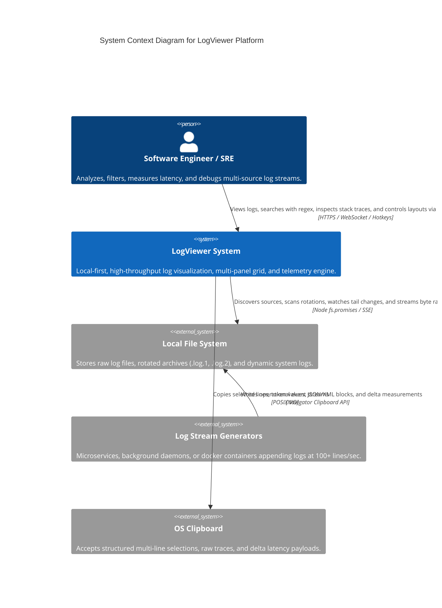
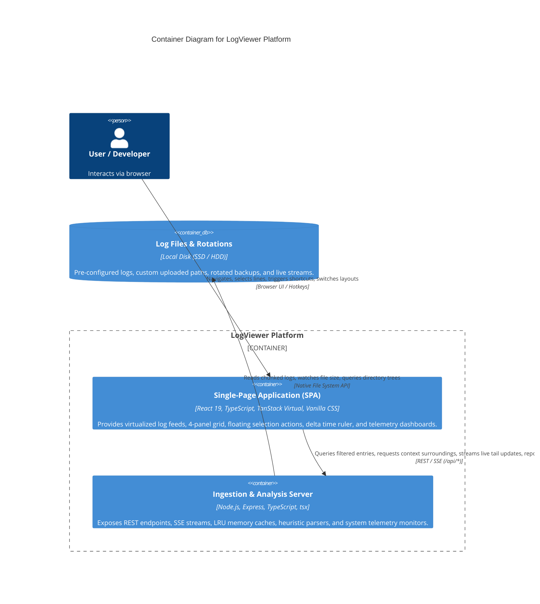
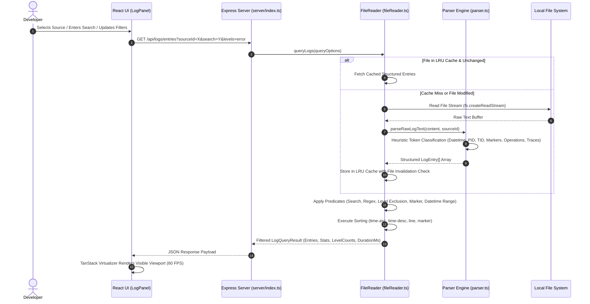
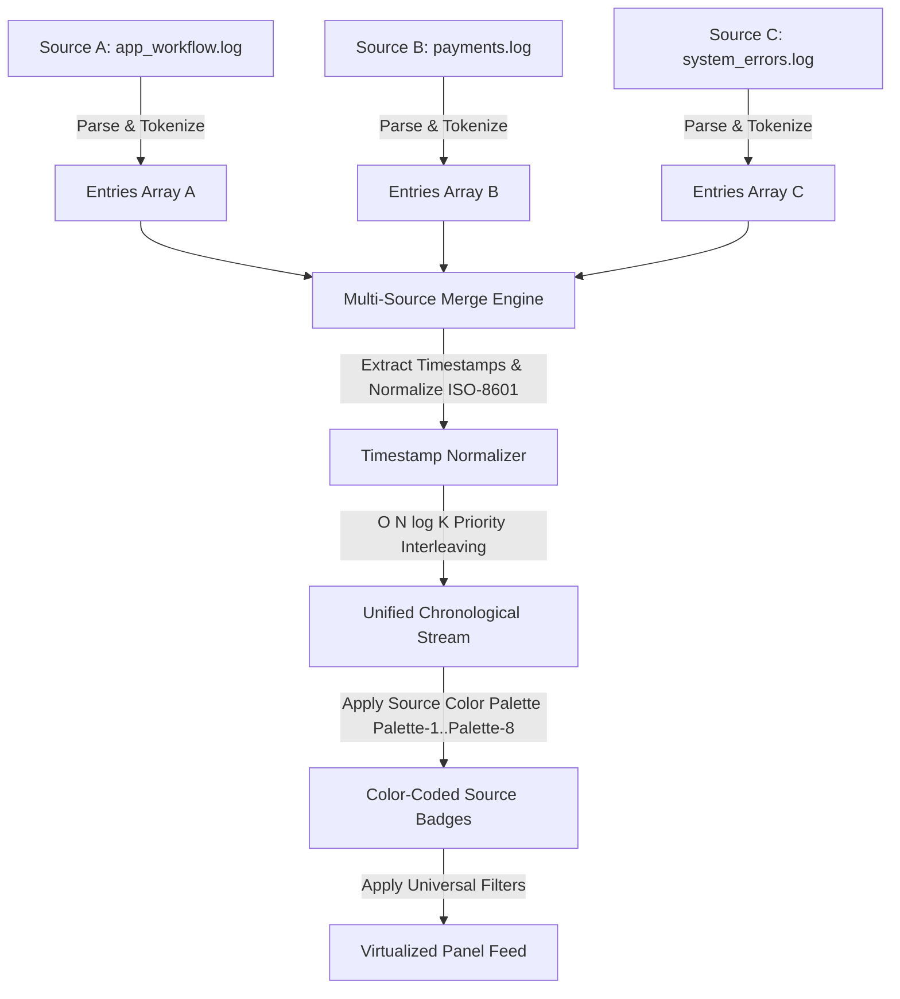
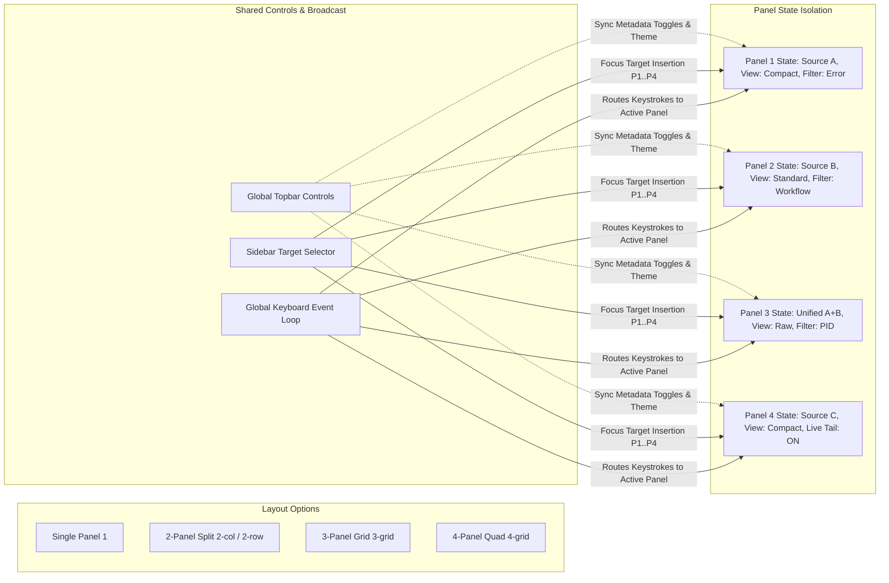

# High-Level Design (HLD): LogViewer Architecture

> **Document Version**: 2.0.0  
> **Status**: Approved & Active  
> **Target System**: Local High-Throughput Structured Log Analysis & Telemetry Platform  
> **Primary Authors**: Core Architecture Engineering Team  

---

## 1. Executive Summary & Problem Statement

Modern microservice, distributed, and backend system development generates massive volumes of semi-structured and unstructured flat log files. Developers and site reliability engineers (SREs) frequently encounter two major extremes:
1. **Cloud Observability Tools (Datadog, Splunk, Elastic)**: Incur high latency, cost, and strict data exfiltration/privacy barriers during local development, integration testing, and offline triage.
2. **Traditional Command-Line Tools (`grep`, `tail -f`, `less`, `awk`)**: Lack multi-panel spatial layouts, interactive token filtering, visual call stack decomposition, delta-time latency measurements, and real-time unified streams across multiple files.

**LogViewer** bridges this gap as a zero-cloud, ultra-fast, local-first web application capable of ingesting, indexing, and rendering massive log streams at **60 frames per second (FPS)** while providing IDE-grade ergonomics, heuristic token classification, and multi-source correlation.

---

## 2. Core Architectural Principles & NFRs

| Principle / NFR | Architecture Strategy | Target Metric / SLA |
| :--- | :--- | :--- |
| **Virtual 60 FPS Rendering** | Virtualized DOM windowing (`@tanstack/react-virtual`) rendering only viewable elements. | Stable 60 FPS up to 1,000,000 log lines |
| **Sub-Millisecond Query Response** | LRU memory caching, zero-copy string slicing, and indexed binary search. | P50 < 4ms, P99 < 50ms for 500k lines |
| **Permissive 0-Config Ingestion** | Dynamic heuristic regex classifier parsing leading brackets, timestamps, and stack traces without requiring predefined schemas. | 100% ingest rate across arbitrary logs |
| **Multi-Panel Isolation & Synchronization** | Independent panel state containers with global coordinate broadcast and focus targeting. | Supports 1, 2-col, 2-row, 3-grid, 4-grid simultaneously |
| **Local-First Zero Data Exfiltration** | Strictly self-contained Node.js & React architecture running on `localhost`. | Zero external network calls; 100% air-gapped |
| **Comprehensive System Telemetry** | Native event-loop, heap, cache, and SLA telemetry with client-side incident tracking. | Real-time health scoring (0–100) & incident audit log |

---

## 3. C4 Architecture Level 1: System Context Diagram

The following C4 Context diagram illustrates how developers, engineers, and external file system streams interact with the LogViewer system boundary:

---

## 4. C4 Architecture Level 2: Container Diagram

The system comprises two core containers: a **Single-Page Application (SPA) Frontend** and a **Node.js High-Throughput Ingestion Backend**:

---

## 5. End-to-End Data Flow Architecture

### 5.1 Ingestion, Parsing & Indexing Flow

### 5.2 Multi-Source Unified Merge Stream Flow
When multiple log files are checked in the sidebar, LogViewer chronologically merges diverse files into a unified timeline:

---

## 6. Multi-Panel Grid Orchestration

The application supports simultaneous multi-file observation through an adaptive grid manager:

---

## 7. Memory & Performance Safeguards

1. **LRU In-Memory Cache**:
   - Fixed capacity caching parsed `LogEntry[]` structures.
   - Cache keys incorporate source ID, file mtime, and file size to eliminate stale data bugs.
2. **Backpressure & Memory Bounds**:
   - Query results default to slicing 15,000 maximum entries per viewport window.
   - Automatic buffer truncation guards prevent browser out-of-memory (OOM) states on multi-gigabyte log streams.
3. **AbortController Request Cancellation**:
   - In-flight fetch queries for any panel are aborted immediately when new filter keystrokes arrive, preventing cascading network stalls.
4. **Debounced Live Tail Polling**:
   - Live stream polling defaults to 500ms intervals with request locking to prevent overlapping tick collisions.

---

## 8. Telemetry & Observability Architecture

LogViewer contains a built-in telemetry engine (`server/metrics.ts` & `src/utils/clientTelemetry.ts`) tracking:
* **Event Loop Latency**: Samples Node.js event loop lag percentiles (Min, Mean, P50, P90, P95, P99, Max).
* **Heap Vitals**: Real-time tracking of heap used, heap total, external memory, and RSS.
* **Query SLA Benchmarks**: P50, P95, and P99 query duration percentiles, slow query threshold detection (>200ms), and throughput QPS.
* **Cache Efficiency**: Hit ratio tracking, miss classification (`initial_load`, `file_modified`, `evicted_lru`), and eviction audits.
* **Client Incident Recording**: Browser crash diagnostics, unhandled promise rejection capturing, and rapid flicker thrashing alerts.
