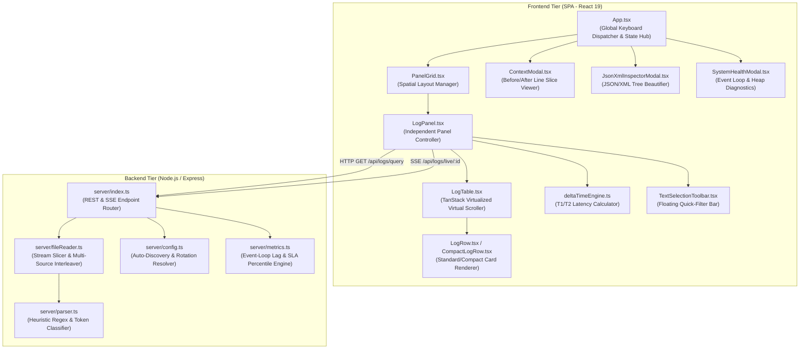
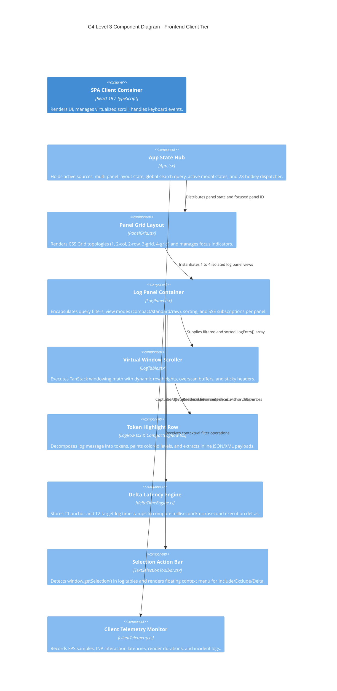
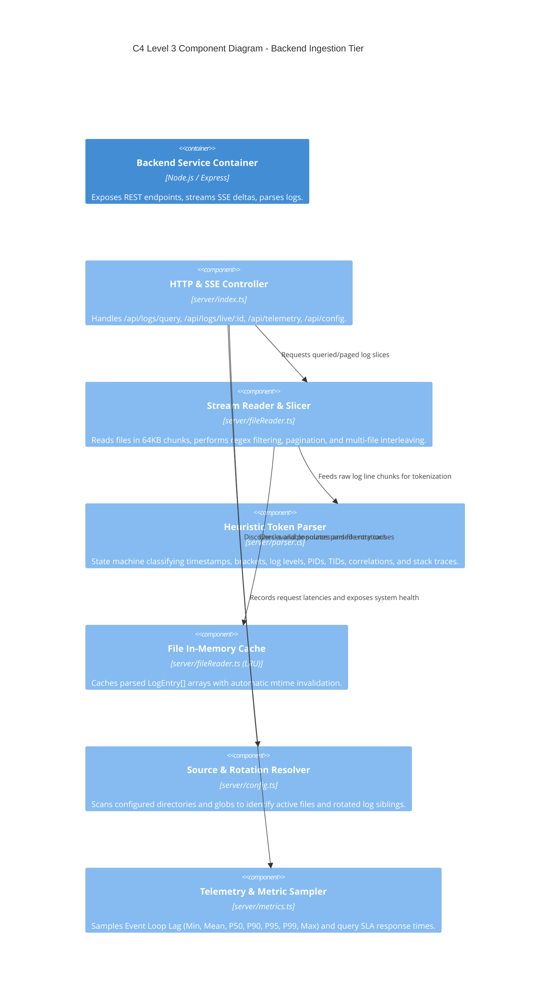
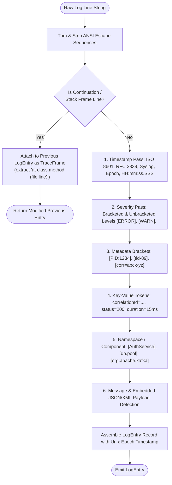
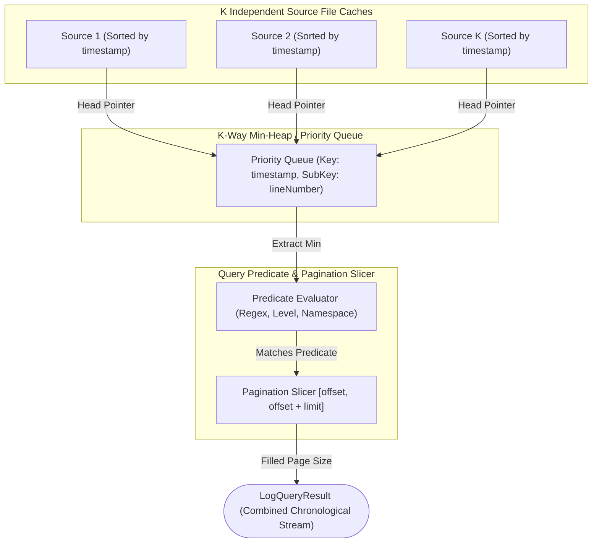
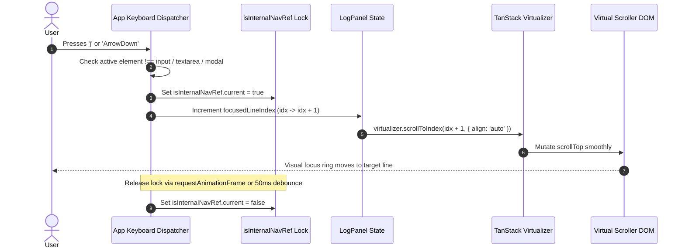
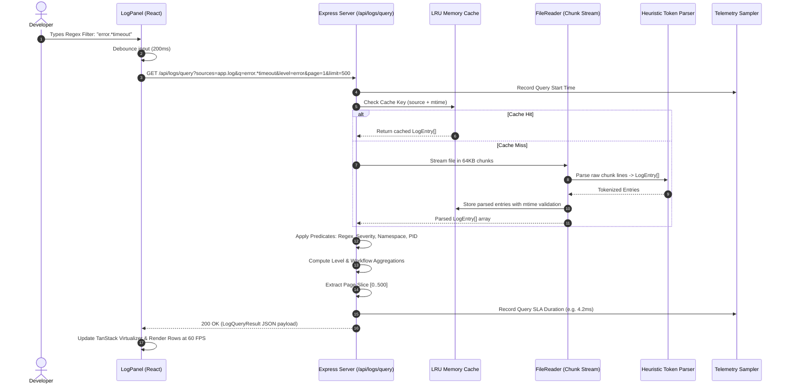
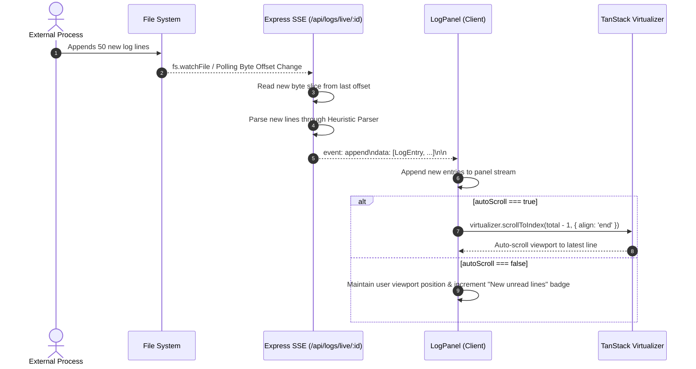

# Low-Level Design (LLD): LogViewer Architecture

> **Document Version**: 2.0.0  
> **Status**: Approved & Active  
> **Target System**: High-Throughput Structured Log Analysis Engine & DOM Virtualizer  
> **Primary Authors**: Core Architecture & Engine Engineering Team  

---

## 1. System Overview & Module Decomposition

LogViewer is architected with a strict separation of concerns across two primary tiers:
1. **Frontend Presentation & Interaction Engine** (React 19, TypeScript, `@tanstack/react-virtual`, Vanilla CSS Tokens)
2. **Backend Ingestion, Parsing & Telemetry Engine** (Node.js, Express, Stream Pipelines, Heuristic Parser, Telemetry Sampler)



---

## 2. C4 Architecture Level 3: Component Diagram

### 2.1 Frontend Component Architecture



### 2.2 Backend Component Architecture



---

## 3. Core Class & Interface Models

### 3.1 Data Structures (`src/types.ts` & `server/types.ts`)

```typescript
export type LogLevel =
  | 'emergency' | 'alert' | 'critical' | 'error' | 'warning'
  | 'notice' | 'info' | 'audit' | 'debug' | 'trace' | 'unknown';

export interface TraceFrame {
  text: string;
  file?: string;
  line?: number;
}

export interface TraceData {
  title?: string;
  frames: TraceFrame[];
  raw: string;
}

export interface LogEntry {
  id: string;               // Unique ID: `${sourceId}-${lineNumber}-${timestamp}`
  lineNumber: number;       // 1-indexed source file line number
  raw: string;              // Exact unmodified raw line string
  datetime?: string;        // ISO 8601 formatted string or raw timestamp
  timestamp?: number;       // Unix epoch in milliseconds for chronological sorting
  sourceId?: string;        // ID of originating log file
  sourceName?: string;      // Human-readable source alias
  sourceColor?: string;     // Assigned distinct palette color for multi-source views
  pid?: string;             // Process Identifier token
  tid?: string;             // Thread Identifier token
  correlationId?: string;   // Trace / Correlation / Request ID token
  namespace?: string;       // Logger namespace / Class path / Component prefix
  workflow?: string;        // High-level operational workflow tag
  operation?: string;       // Specific method, endpoint, or action
  status?: string;          // Execution status: SUCCESS, FAILED, TIMEOUT, 200, 500
  duration?: string;        // Measured duration string: e.g. "45ms", "1.2s"
  message: string;          // Main log message body after token extraction
  fileLocation?: string;    // Originating source code file and line number
  level: LogLevel;          // Normalized severity classification
  trace?: TraceData;        // Parsed multi-line stack trace if present
}

export interface LogQueryResult {
  entries: LogEntry[];
  total: number;
  page: number;
  pageSize: number;
  totalPages: number;
  levelCounts: Record<LogLevel, number>;
  workflowCounts: Record<string, number>;
  operationCounts: Record<string, number>;
  correlationCounts?: Record<string, number>;
  durationMs: number;
}

export interface PanelState {
  id: string;                               // 'panel-1' | 'panel-2' | 'panel-3' | 'panel-4'
  selectedSources: string[];                // Array of active source IDs (supports combined streams)
  searchQuery: string;                      // Free text or regex query
  selectedLevels: LogLevel[];               // Active severity filter set
  selectedNamespaces: string[];             // Active namespace filter set
  selectedPids: string[];                   // Active PID filter set
  selectedWorkflows: string[];              // Active Workflow filter set
  selectedOperations: string[];             // Active Operation filter set
  selectedCorrelations: string[];           // Active Correlation ID filter set
  sortOption: SortOption;                   // Sorting strategy ('time-desc', 'time-asc', 'line-asc', etc.)
  viewMode: 'compact' | 'standard' | 'raw'; // Row density and rendering mode
  autoScroll: boolean;                      // Real-time live tail auto-scroll anchor
  fontSize: number;                         // Font scaling (10px - 18px)
  lineWrap: boolean;                        // Word wrap vs horizontal scroll
  visibleColumns: Record<string, boolean>;  // Dynamic column visibility toggles
  selectedLineIds: Set<string>;             // Multi-select active lines
  focusedLineIndex: number | null;          // Keyboard cursor line index
}
```

---

## 4. Key Algorithms & Implementation Logic

### 4.1 Heuristic Token Classification State Machine (`server/parser.ts`)

The parser operates without requiring fixed schemas or JSON formats. It utilizes a multi-pass heuristic regex state machine to tokenize flat log lines into structured fields:



#### Token Recognition Table
| Field | Regex Patterns / Heuristic Rules | Extracted Output |
| :--- | :--- | :--- |
| **Timestamp** | `^\[?(\d{4}-\d{2}-\d{2}[T\s]\d{2}:\d{2}:\d{2}(?:\.\d+)?(?:Z|[+-]\d{2}:?\d{2})?)\]?` | `datetime`, `timestamp` |
| **Log Level** | `\b(EMERGENCY\|ALERT\|CRITICAL\|FATAL\|ERROR\|WARN(?:ING)?\|NOTICE\|INFO\|AUDIT\|DEBUG\|TRACE)\b` | `level: LogLevel` |
| **PID / TID** | `\[(?:pid|PID|process)[:=]?\s*(\d+)\]` / `\[(?:tid|TID|thread)[:=]?\s*(\w+)\]` | `pid`, `tid` |
| **Correlation ID** | `\[?(?:corr(?:elation)?(?:_|-)?id\|trace(?:_|-)?id\|req(?:uest)?(?:_|-)?id)[:=]\s*([a-zA-Z0-9_-]+)\]?` | `correlationId` |
| **Namespace** | `\[([a-zA-Z0-9_.-]+(?:\.[a-zA-Z0-9_.-]+)+)\]` or leading `([a-zA-Z0-9_]+::[a-zA-Z0-9_]+)` | `namespace` |
| **Duration** | `\b(?:took\|duration\|in)[:=]?\s*(\d+(?:\.\d+)?\s*(?:ms\|s\|µs\|ns))\b` | `duration` |
| **Status Code** | `\b(?:status|code|HTTP)[:=]?\s*([1-5]\d{2})\b` | `status` |

---

### 4.2 Multi-Source Unified Merge Algorithm ($O(N \log K)$)

When multiple log sources are selected in a single panel, the backend executes an indexed k-way merge sort across active streams:



#### Merge Complexity:
- **Time Complexity**: $O(N \log K)$ where $N$ is the total candidate entries and $K$ is the number of active sources.
- **Space Complexity**: $O(K)$ auxiliary memory for the Priority Queue pointers.

---

### 4.3 Virtual Table Height & Overscan Optimization Math (`LogTable.tsx`)

To maintain a consistent 60 FPS without layout thrashing, the virtual table dynamically adapts row heights based on view mode and expansion states:

$$\text{Estimated Row Height } H_{\text{row}} = \begin{cases} 
24\text{ px} & \text{if } \text{viewMode} = \text{'compact'} \\
32\text{ px} & \text{if } \text{viewMode} = \text{'raw'} \\
54\text{ px} & \text{if } \text{viewMode} = \text{'standard'} \text{ and not expanded} \\
54 + 20 \times N_{\text{frames}} + H_{\text{payload}}\text{ px} & \text{if } \text{expanded}
\end{cases}$$

$$\text{Render Viewport Slices } [I_{\text{start}}, I_{\text{end}}] = \left[ \max\left(0, \left\lfloor \frac{S_{\text{top}}}{H_{\text{avg}}} \right\rfloor - O_{\text{scan}}\right), \min\left(N_{\text{total}}, \left\lceil \frac{S_{\text{top}} + V_{\text{height}}}{H_{\text{avg}}} \right\rceil + O_{\text{scan}}\right) \right]$$

Where:
- $S_{\text{top}}$ = Scroll container `scrollTop` offset
- $V_{\text{height}}$ = Viewport client height
- $O_{\text{scan}}$ = Overscan buffer (configured to `10` items above and below)
- $H_{\text{avg}}$ = Dynamic measured rolling average height from TanStack virtualizer

---

### 4.4 Conflict-Free Keyboard Navigation & `isInternalNavRef` Dispatcher

LogViewer supports 28 high-precision keyboard shortcuts. To avoid race conditions between programmatic scrolling, user scrolling, and keyboard selections, the system uses an atomic navigation lock:



#### Shift-Selection Range Logic:
When the user presses `Shift + ArrowDown` or `Shift + ArrowUp`:
1. If no anchor exists, set `anchorIndex = currentFocusedIndex`.
2. Compute range: $[\min(\text{anchorIndex}, \text{newIndex}), \max(\text{anchorIndex}, \text{newIndex})]$.
3. Batch update `selectedLineIds` Set with all `entry.id` keys within the range.
4. Update UI counter: `"N lines selected"` and render floating selection bar.

---

### 4.5 Delta Time Latency Calculation Engine (`src/utils/deltaTimeEngine.ts`)

```typescript
export interface DeltaTimeResult {
  anchorEntry: LogEntry;
  targetEntry: LogEntry;
  deltaMs: number;
  deltaFormatted: string;
  isPositive: boolean; // true if target is chronologically after anchor
  ratePerSec?: number;
}

export function computeDeltaTime(anchor: LogEntry, target: LogEntry): DeltaTimeResult | null {
  const t1 = anchor.timestamp ?? (anchor.datetime ? Date.parse(anchor.datetime) : null);
  const t2 = target.timestamp ?? (target.datetime ? Date.parse(target.datetime) : null);

  if (t1 === null || t2 === null || isNaN(t1) || isNaN(t2)) {
    return null;
  }

  const deltaMs = t2 - t1;
  const absDelta = Math.abs(deltaMs);

  let deltaFormatted = '';
  if (absDelta < 1) {
    deltaFormatted = `${(absDelta * 1000).toFixed(0)} µs`;
  } else if (absDelta < 1000) {
    deltaFormatted = `${absDelta.toFixed(2)} ms`;
  } else if (absDelta < 60000) {
    deltaFormatted = `${(absDelta / 1000).toFixed(3)} s`;
  } else {
    const mins = Math.floor(absDelta / 60000);
    const secs = ((absDelta % 60000) / 1000).toFixed(1);
    deltaFormatted = `${mins}m ${secs}s`;
  }

  return {
    anchorEntry: anchor,
    targetEntry: target,
    deltaMs,
    deltaFormatted: deltaMs >= 0 ? `+${deltaFormatted}` : `-${deltaFormatted}`,
    isPositive: deltaMs >= 0,
  };
}
```

---

## 5. C4 Architecture Level 4: Code & Sequence Diagrams

### 5.1 End-to-End Query Execution Lifecycle



### 5.2 Real-Time SSE Live Tail & Auto-Scroll Pipeline



---

## 6. Error Handling, Memory Boundaries & Telemetry

### 6.1 Memory Safeguards
1. **Server Heap Cap**: Maximum in-memory cache allocation capped at 256MB with aggressive LRU eviction for rotated log files.
2. **Streaming Chunk Size**: Standard read streams capped at 64KB buffers to avoid node buffer allocations exceeding 2GB V8 limits.
3. **Frontend DOM Capping**: At any instant, DOM nodes rendered are strictly $V_{\text{height}} / H_{\text{row}} + 20$ (approx. 40 to 80 DOM nodes), regardless of whether the log file has 1,000 or 1,000,000 lines.
4. **AbortController Cancellation**: Every inflight HTTP query binds to an `AbortController`. When user modifies filters before previous query returns, previous request is cancelled immediately.

### 6.2 Health & Telemetry Metrics Engine (`server/metrics.ts`)
The server continuously samples operational vitals:
- **Event Loop Lag**: `monitorEventLoopDelay({ resolution: 20 })` calculates Min, Mean, P50, P90, P95, P99, Max lag.
- **Heap Vitals**: `process.memoryUsage()` tracks `heapUsed`, `heapTotal`, `rss`, `external`.
- **System Health Score ($0 - 100$)**: Computed from weighted lag degradation, heap saturation, and query error rates.
